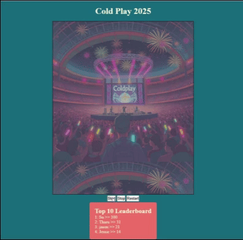

# Coldplay Canvas Game 🎶  

I built a fun canvas-based game inspired by Coldplay, where players bounce a ball, score points, and compete on a **global leaderboard** powered by Supabase.  

**Project Link:** [Coldplay Game](https://coldplay.binukandagedon.net/)

  

---

## How It’s Made  

**Tech Stack:** HTML, CSS, JavaScript, Vite, Supabase  

To run the project locally:  
1. Fork the repository  
2. Run `npm install`  
3. Start the dev server with `npm run dev`  
4. Set up your Supabase project and update your environment variables in `.env`  

---

## Optimizations  

Currently, the game allows anyone to play and appear on the leaderboard. Future improvements include:  
- Adding authentication so users can track multiple high scores  
- Improving mobile responsiveness and controls  
- Adding new levels, effects, and sound integration  

---

## Lessons Learned  

- Learned how to integrate **Supabase** for storing and retrieving leaderboard data  
- Gained experience with **Canvas API** for drawing and animating game objects  
- Practiced handling **localStorage** for persisting player names and unique IDs  
- Understood the importance of **image loading and asset paths** when deploying with Vite on GitHub Pages  
